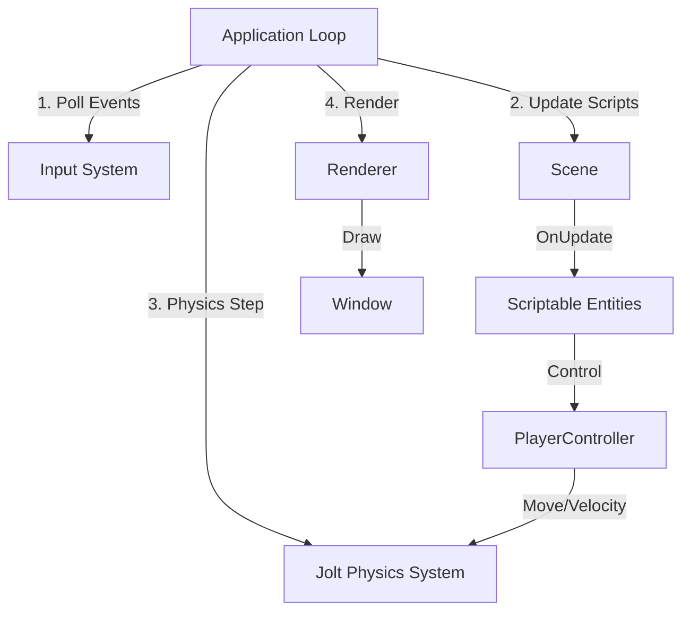

# Source67

A simple, modern 3D game engine written in C++ for learning purposes. Source67 features a Quake-style console, Jolt Physics integration, and a native C++ scripting system.

## 🚀 Quick Start

**New to Source67?** Start here:
- **Building your game:** [BUILDING.md](BUILDING.md) 🔨 - Use the in-editor build menu!
- **Understanding the architecture:** [GAME_PROJECT_GUIDE.md](GAME_PROJECT_GUIDE.md) 🎮
- **First-time setup:** [QUICK_START_GUIDE.md](QUICK_START_GUIDE.md) ⭐

This comprehensive guide walks you through:
- ✅ What goes where (DLL vs asset pack vs your game folder)
- ✅ **Lua vs C++ scripting** - both work for game code!
- ✅ How the build process works
- ✅ Building from the editor (easy!)
- ✅ Installing prerequisites
- ✅ Running and testing
- ✅ Troubleshooting common issues

**TL;DR:**
```cmd
# Windows (from Source67 root directory in Command Prompt)
build.bat Debug all
cmake-build-debug\Debug\Source67.exe

# Linux/macOS
./build.sh Debug all
./cmake-build-debug/Source67
```

## Engine Architecture

The engine follows a component-based architecture where the `Application` manages the main loop, systems, and the active `Scene`. Entities in the scene can be controlled via attached native C++ scripts.



## Features

- **Renderer**: OpenGL 4.5 based renderer with custom shaders and texture support.
- **Physics**: Integrated **Jolt Physics** engine with a Virtual Character Controller for smooth player movement (Source-engine style air strafing implemented).
- **Scripting**: Unity-like native C++ Scripting system allowing entities to have multiple custom logic components (`OnCreate`, `OnUpdate`, `OnDestroy`). Managed via Inspector.
- **Tags**: Entity tagging system (up to 10 tags per entity) for easy identification in scripts.
- **HUD**: Text queueing system for scripts to display information on the screen.
- **Console**: Quake-style in-game console (`~` key) with support for Variables (ConVars) and Commands.
- **Editor Tools**: ImGui-based editor with Scene Hierarchy, Inspector, Content Browser, and Console panels.

## Scripting Guide

To create custom behavior, inherit from `S67::ScriptableEntity`. The engine handles instantiation and binding.

### Creating a New Script

1. Inherit from `S67::ScriptableEntity`.
2. Use `REGISTER_SCRIPT(ClassName)` to make it available in the editor.
3. Call `HUDRenderer::QueueString` to show text on the HUD.

```cpp
#include "S67.h"
#include "Renderer/ScriptRegistry.h"
#include "Renderer/HUDRenderer.h"

class MyScript : public S67::ScriptableEntity {
public:
    void OnCreate() override {
        S67::Console::Get().AddLog("Script Created!");
    }

    void OnUpdate(float ts) override {
        // Input Handling
        if (S67::Input::IsKeyPressed(S67::Key::Space)) {
            S67_CORE_INFO("Jump!");
            // Queue text to HUD (upper center)
            S67::HUDRenderer::QueueString("Space Pressed!", {0.0f, 1.0f, 0.0f, 1.0f});
        }

        // Access Transform
        auto& transform = GetTransform();
        transform.Rotation.y += 90.0f * ts;
        
        // Check for tags
        if (GetEntity().Tags.size() > 0) {
            S67::HUDRenderer::QueueString("I have tags!");
        }
    }
};

REGISTER_SCRIPT(MyScript);
```

### Player Controller Implementation

The `PlayerController` uses Jolt Physics for collision handling and implements Source-engine movement physics (acceleration, friction, air-strafing).

Key functions available in `PlayerController`:

- `GetVelocity()` / `GetSpeed()`
- `SetSettings(MovementSettings)` (Configurable via Console)
- `OnEvent(Event& e)` for mouse look.

## Console Commands

Press `~` to open the console.

- `help` : List all commands
- `clear` : Clear console output
- `sv_gravity` : Set gravity (default 800)
- `sv_maxspeed` : Set move speed
