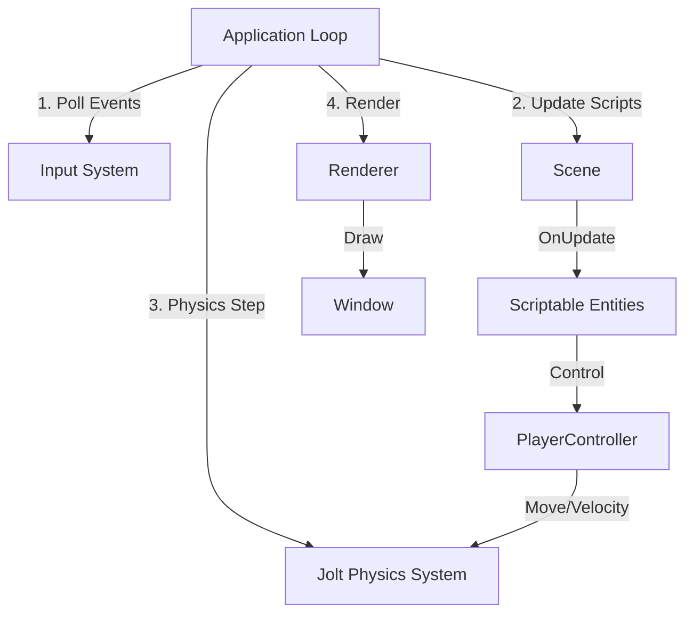

# Source67

A simple, modern 3D game engine written in C++ for learning purposes. Source67 features a Quake-style console, Jolt Physics integration, and a native C++ scripting system.

## Engine Architecture

The engine follows a component-based architecture where the `Application` manages the main loop, systems, and the active `Scene`. Entities in the scene can be controlled via attached native C++ scripts.



## Features

- **Renderer**: OpenGL 4.5 based renderer with custom shaders and texture support.
- **Physics**: Integrated **Jolt Physics** engine with a Virtual Character Controller for smooth player movement (Source-engine style air strafing implemented).
- **Scripting**: Native C++ Scripting system allowing entities to have custom logic (`OnCreate`, `OnUpdate`, `OnDestroy`).
- **Console**: Quake-style in-game console (`~` key) with support for Variables (ConVars) and Commands.
- **Editor Tools**: ImGui-based editor with Scene Hierarchy, Inspector, and Console panels.

## Scripting Guide

To create custom behavior, inherit from `S67::ScriptableEntity`. The engine handles instantiation and binding.

### creating a New Script

```cpp
#include "S67.h"

class MyScript : public S67::ScriptableEntity {
public:
    void OnCreate() override {
        S67::Console::Get().AddLog("Script Created!");
    }

    void OnUpdate(float ts) override {
        // Input Handling
        if (S67::Input::IsKeyPressed(S67::Key::Space)) {
            S67_CORE_INFO("Jump!");
        }

        // Access Transform
        auto& transform = GetComponent<TransformComponent>();
        transform.Rotation.y += 90.0f * ts;
    }

    void OnDestroy() override {
        // Cleanup
    }
};
```

### Player Controller Implementation

The `PlayerController` uses Jolt Physics for collision handling and implements Source-engine movement physics (acceleration, friction, air-strafing).

Key functions available in `PlayerController`:

- `GetVelocity()` / `GetSpeed()`
- `SetSettings(MovementSettings)` (Configurable via Console)
- `OnEvent(Event& e)` for mouse look.

## Console Commands

Press `~` to open the console.

- `help` : List all commands
- `clear` : Clear console output
- `sv_gravity` : Set gravity (default 800)
- `sv_maxspeed` : Set move speed
